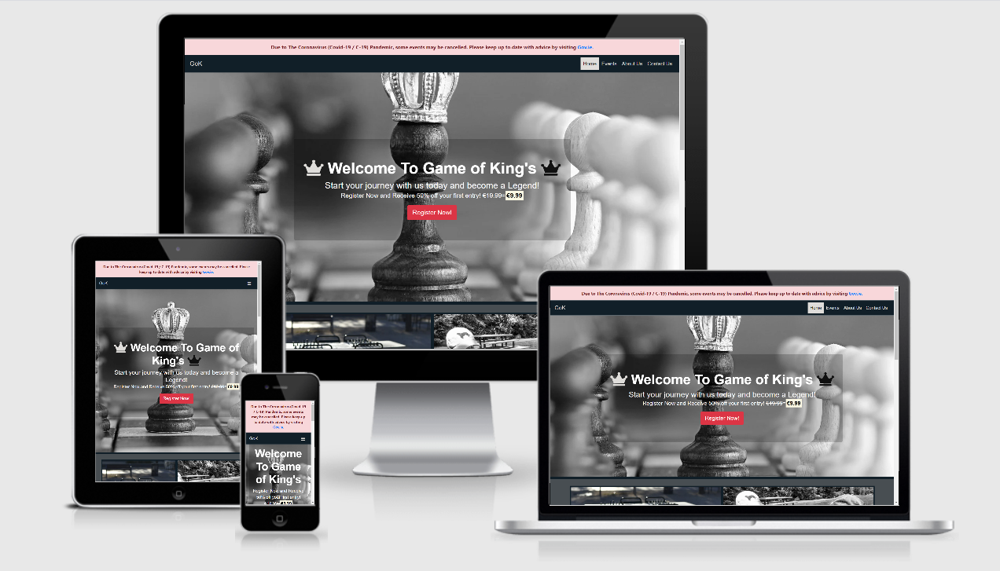

# Game of King's

### Chess Event Organiser

A website designed to allow user's to sign up to compete in real world chess tournaments as well as online chess tournaments. It features a register button on the homepage to allow users to bypass all information on the site instantly to sign up and feature some popular news and chess moves for novices that may enter the site so as to cater for all levels of players. It also features an event page listing all events currently open for application, an about page detailing information about the company and what they do and what their goals are, and a contact page to ask question's before any potential sign up.

This website was designed to be simple as the main goal is to get the user to register with their details and a special discount is provided upon registration to entice them to commit. The events page provides details of the tournaments along with locations and prize money involved to as to excite the user into entering. 

#### Business Goals
  - To increase traffic to the site and in turn increase registration.
  - To provide simple easy sign up process to enable any aged users to register.
  - To provide simple yet comprehensive information on what to expect from the tournaments.
  - To be visually striking enough to catch attention and provoke curiosity to explore the page.
  - To potentially encourage advertisers to place their ads on the page for tournaments  thus opening up more opportunities for tournaments and expansion of the site.
  - To build awareness of the brand and the tournaments online to allow easy entering.
 
#### Customer Goals
  - To find an easy way to enter tournaments.
  - To be able to find any information they may need.
  - To see benefits to signing up for such a site.

# UX

 #### Potential Customers
  - Mainly adults looking to compete but minors can enter with parents/guardians consent.
  - Can be any skill level as multiple tournaments will be displayed for varied ages and levels.
  - Will have an interest in making money off a small registration fee.
  - Will like to have the option of entering an online tournament due to Covid-19 restrictiong physical events.

#### This website will provide value with
  - An easy sign up process.
  - A Simple format to navigate for older and younger users alike.
  - Accurate information detailing why it is convenient.
  - A good UX so as to encourage visitors to return and continue to use to site to enter tournaments.
  - Up to date news and help for novice and seasoned users alike.

#### User Stories

 1. As a new user I want to know the sites purpose immediately.
 2. As a new user I expect to be able to navigate the site easily to find anything I'm looking for.
 3. As a new user I expect to be able to sign up to services.
 4. As a new user I expect to be able to contact the business to ask question prior to signing up.
 5. As a new user I expect to be able to find additional information to help my decision.
 6. As a potential customer I want an easy sign up process.
 7. As a potential customer I want reassurance that the service is indeed worth it.
 8. As a potential customer I want to be able to easily know how much this service will cost me.
 9. As a returning user I want news and other useful content to entice me to return.
 10. As a returning user I want to be able to have access to follow the company on social media.

# Design

## Colour Scheme

The site features a few choice colors being :
- **Dark Cyan-Blue** similar to **Black Pearl** (#111f28),
- **Snowfall** (#dfddda), 
- **White** (#fff), 
- **Black** (#101010), 
- **Grey** similar to **Trout** (#484e52),
- **Baltic Sea** (#343a40)
- **Pale red** (#f8d7da)
- **Amaranth** (#dc3545).

These colours were chosen to give a **dark, moody** feel to the website but not have it so dark that it was not a user friendly environment.
Also some of the colors were used to give a chess feel with the contrast between black and white the most obvious chess colours apparent throughout the site.
The 2 exceptions being the alert color of **Pale red (#f8d7da)** and button color **Amaranth (#dc3545)** which were used to add good visual contrast and draw the users attention to these areas.

## Fonts 

- The site mainly uses the **"Lobster"** font for easyness to read as there is not much styling to it and it gave a sort of "chessy" feel to the site and it has a fallback of **"sans-serif"**.
- The **italics** areas contained within the homepage and events pages were styled with **"Inconsolata"** with a fallback of **"sans-serif"** also,
to give a good separation visually of important information within the text. 

## Imagery

The images used are all **chess related**. I thought it was important to have a consistant theme of visually striking images,
that were all close enough in subject matter and color to make a consistent feel across the site.The color of the images was important to have good crossover with the site **color scheme** and 
I believe the images chosen fit very well overall as the relate to the subject matter but also provide good impact both visually in arrangment and colour wise.

### Wireframes

- The wireframes were created using **[Balsamiq](https://balsamiq.com/wireframes/?gclid=CjwKCAiA8Jf-BRB-EiwAWDtEGkJ6iKra1Rpbr_P_NWTlH_xSyg5fnl9cG87m1uVtg1HJKb3bCsG0BhoC3yMQAvD_BwE)** and were used as a rough guideline towards the finished product visualisation.

- Mobile

- Tablet

- Desktop

# Features

### Common features on all pages 

The site features a responsive navigation bar stuck **on top** for easy navigation to the different pages.The logo on the **top left** will provide a one click link to the **Home** page this is inlcluded on every page.The navigation bar is also linked to the other pages **Home**,**Events**, **About Us**, **Contact Us** to allow easy access to any information the user may require,this is contained within a drop down menu for mobile devices.
A **Register Now** button is located on the homepage hero image for desktop and just **under** the hero image on smaller devices to allow sign up easily and instantly this is done by way of a **modal form**.
Has a footer containing social media links to **Facebook**, **Instagram**, **Twitter**, **Youtube** and **LinkedIn**.
Has a Covid-19 **alert** on each page to warn users that certain events may be cancelled.The **images**, **fonts** and **colors** were also continued page to page
to give uniformity to the appearance and provide a consistent experience.

### Home Page 
- Has a hero image with a **register now** button located on it,it is presented as a modal with a **form** containing **First Name**, **Last Name**, **Email Address** and a **Register Now!** button.
- Has an **About Us** section with linked text over the image provided to redirect user to the **About Us** page.
- Has an **Events** scetion with linked text over the image provided to redirect user to the **Events** page.
- Has a section containing **images** and **buttons** which lead to pages explaining **Common Attacks**, **Common Opening moves**, **Common Tactics** and **Common Endgame Moves**.

### Events Page 
- Has an appropriate **image** on top of page that is related to competitive play.
- Has an **image** beside each of the events to give a rough visual aesthetic beside each explanation.
- Has **details** for each **event** which will include **Event name**, **Location**, **Date & time**, **Price of entry**, **Skill Level** and **Prize**.
- Has another **register now** modal built in to each **button** to enter to allow registering once the user has read some of the event information and wants to register.
- The page also contains a **table** showing current **World ranking** and an area to the right providing and **explaination** of the ranking system.

### About Us Page
- Has an appropriate **image** on top of page that is used to continue a similar theme throughout pages.
- Has an **chessboard** design containing basic info on each chess piece.
- Has **information** about the company in the **About Us** section providing insight to the user about the company and its roots.
- Has detailed **information** about the companies **Goals** and values and why I created the space online.

### Contact Us Page
- Has an appropriate **image** on top to continue the theme across pages.
- Has a simple **form** on the left to email any questions of queries to the company with 4 steps to fill out **Name**, **Surname**, **Email** and the **Question** to be asked.
- It also features a **submit button** attached to the form.

### Existing Features 
- **Logo** - Allows user to navigate to **home** page from anywhere on the site, located on all pages.
- **Navigation bar** - Allows user to navigate site and contains links to every page contained within dropdown menu for mobile devices, located on all pages and stuck to top of page to allow 
easy access to each page regardless of current location. The bar also changes color to show the user their current location.
- **Register Now Button** - Opens **modal** to allow user to register immediately upon landing on site.
- **Footer** - Contains social media links to **[Facebook](https://www.facebook.com/)**, **[Instagram](https://www.instagram.com/)**, **[Twitter](https://twitter.com/)**, **[YouTube](https://www.youtube.com/)** and **[LinkedIn](https://www.linkedin.com/)**, it also contains copyright data and is located on all pages.
- **Home Page Icons** - Contains links to useful information on **[Wikipedia](https://www.wikipedia.org/)** for novice and seasoned players as well as a link to **[Chessbase.com](https://en.chessbase.com/)** for up to date news regarding chess.
- **About Us Page** - Contains useful **information** regarding the company which may help first time users to establish the companies purpose.
- **Events Page** - Contains useful information about **events** and **pricing** as well as **prizes**,**level of difficulty** and **location** for entry into tournaments.

### Features Left to Implement
- Option to change **languages** to some other than English.Too expensive to hire someone to check translations on current budget.
- **Terms and conditions** page to allow users to read through the legal documentation associated with the site.Too much time involved reviewing legal documentation to implement straight away.
- Members **sign in area**.Will require another page which time doesnt allow for currently.
- Ability to display chess and other game related **advertisements** on website. Site budget doesnt allow for recruiting advertisers presently.
- **Chat page** for people playing the online tournaments and a **online spectating area** for guests to view live games.Current budget not suitable to use the technologies required to implement this.

# Technologies Used
- **[HTML5](https://en.wikipedia.org/wiki/HTML5)** -To write core content contained on site.
- **[CSS3](https://en.wikipedia.org/wiki/CSS)** -To style core content displayed on site.
- **[BootstrapCDN](https://www.bootstrapcdn.com/)** -Used to help style and provide grids for layout of the site. Also used to design the site with mobile first mindset and implement features for responsiveness such as the navigation bar more easily.Bootstrap version 4.5.2 was used and was also used to provide links to **[FontAwesome](https://fontawesome.com/)** for icons and to help with the register now modal.
- **[jQuery](https://jquery.com/)** -Used to reference Javascript used for register now modal.
- **[FontAwesome](https://fontawesome.com/)** -Used as a link and source for icons displayed on site.
- **[Google Fonts](https://fonts.google.com/)** - Used to link and source fonts for the site.
- **[Pixabay](https://pixabay.com/)** - Used to source copyright free images for the site which were downloaded and then linked in files when needed.
- **[Gitpod](https://www.gitpod.io/)** -Used as the interactive development environment (IDE) for the project.
- **[GitHub](https://github.com/)** -Used to display and share all files related to the project.
- **[Balsamiq](https://balsamiq.com/wireframes/?gclid=CjwKCAiA8Jf-BRB-EiwAWDtEGkJ6iKra1Rpbr_P_NWTlH_xSyg5fnl9cG87m1uVtg1HJKb3bCsG0BhoC3yMQAvD_BwE)** - Used to create wireframes for the site.

# Testing 

## Navbar Functionality 

 - **Aim** - When the **GoK** icon on the left of navbar is clicked it redirects user to homepage.
 - **Result** - This was done and user is redirected therefore passing the test.
 - **Aim** - When links to other pages are clicked, the user is redirected to the mentioned page.
 - **Result** - Navbar link clicked and redirected to corresponding page therefore passing the test.
 - **Aim** - When screen size is reduced the **hamburger** icon displays and when clicked redirects user to corresponding page.
 - **Result** - Screen size reduced activates **hamburger** icon and when clicked it reveals the page navigation which when clicked redirects user to corresponding page 
therefore passing the test.
 - **Aim** - To see whether nagivation bar stays on the top of the screen on both all screen sizes.
 - **Result** - Screen size was reduced and navigation bar sticks to top of page on all sizes therefore passing the test.
 - **Aim** - When **navbar** navigation link to other pages is clicked colour should change indicating current page.
 - **Result** - Links clicked and colour changes showing users current location therefore passing the test.

## Footer Functionality

- **Aim** - **Social links** are contained in the footer and should redirect user to social media pages in a new tab.
- **Result** - Links were clicked and they open in a new tab to corresponding social media websites therefore passing the test.
- **Aim** - Footer should be always at the bottom of page.
- **Result** - Content from pages was removed and added again to see if the footer changed position and it remained on the bottom of page therefore passing the test.

## Button/Link Functionality 

### Buttons 

- **Aim** - When the **register now** button is clicked it opens a modal of a form to register
- **Result** - Button is clicked and opens modal as expected therefore passing the test.
- **Aim** - When **form fields** within modal are not filled out button in form will not submit due to required attribute.
- **Result** - When all fields are filled out the submit button works when clicked but when even one isnt the reuired information prompt displays therfore passing the test.
- **Aim** - When **events** button is clicked it redirects user to events page.
- **Result** - Events button clicked and user redirected to events page therefore passing the test.
- **Aim** - When **about us** button is clicked it redirects user to the **about us** page.
- **Result** - About button clicked and user redirected to **about us** page therefore passing the test.
- **Aim** - When the **go there** button is clicked it should re-direct user to external pages in a new tab.
- **Result** - When each **go there** was clicked it redirected user to external page in new tab therefore passing the test.
- **Aim** - When the **enter now** buttons on event page are clicked a modal should open to allow user to enter competition but they are required to register first so it will be a registration modal  located on homepage.
- **Result** - When each button is clicked it opens registration modal therefore passing the test.
- **Aim** - When **contact form** submit is clicked it should only work when reuired fields have been filled out.
- **Result** - Button clicked and doesnt submit until reuired info is enter therefore passing the test.

### Links

- **Aim** - When **covid-19**, **Gov.ie** link is clicked it should redirect user to Gov.ie.
- **Result** - Link was clicked and user redirected to **Gov.ie** in a new tab therefore passing the test.
- **Aim** - When the **elo** link to learn more about the **glicko** system is clicked it should redirect the user to an external page in a new tab.
- **Result** - Link was clicked and redirects to **wikipedia** page containing info on **glicko** system therefore passing the test.

## CSS3 Validator 

- **Results** = **Passed** with no errors found.

## HTML5 Validator

- **Homepage** = **Passed**- No errors found. [Results](https://validator.w3.org/nu/?doc=https%3A%2F%2F8000-b8ed666b-bab9-44e0-9bc8-805ee047022b.ws-eu03.gitpod.io%2Findex.html)
- **Events page** = **Passed** - No errors found. [Results](https://validator.w3.org/nu/?doc=https%3A%2F%2F8000-b8ed666b-bab9-44e0-9bc8-805ee047022b.ws-eu03.gitpod.io%2Fevents.html)
- **About us page** = **Passed** - No errors found. [Results](https://validator.w3.org/nu/?doc=https%3A%2F%2F8000-b8ed666b-bab9-44e0-9bc8-805ee047022b.ws-eu03.gitpod.io%2Fabout.html)
- **Contact us page** = **Passed** - No errors found. [Results](https://validator.w3.org/nu/?doc=https%3A%2F%2F8000-b8ed666b-bab9-44e0-9bc8-805ee047022b.ws-eu03.gitpod.io%2Fcontact.html)

## Compatibility

| Screen              | Google Chrome    | Safari           | Microsoft Edge   | Opera            | Mozilla Firefox  | Internet Explorer |
| --------------------|:----------------:|:----------------:|:----------------:|:----------------:|:----------------:|:-----------------:|
| Mobile              |     Passed:heavy_check_mark:|     Passed:heavy_check_mark:|     Passed:heavy_check_mark:|     Passed:heavy_check_mark:|     Passed:heavy_check_mark:| N/A               |
| Tablet              |     Passed:heavy_check_mark:|     Passed:heavy_check_mark:|     Passed:heavy_check_mark:|     Passed:heavy_check_mark:|     Passed:heavy_check_mark:| N/A               |
| Desktop             |     Passed:heavy_check_mark:|     Passed:heavy_check_mark:|     Passed:heavy_check_mark:|     Passed:heavy_check_mark:|     Passed:heavy_check_mark:| N/A               |

- The devices used for iOS testing were Macbook Pro, iPad mini, iPhone 10 and iPhone 8.
- The devices used for android testing were Huawei P30, Samsung A40, Samsung S20 aswell as Samsung Galaxy tab A7.
- For Windows 10 testing a HP pavillion was used as well as a HP Chromebook.
- Chrome Dev Tools was used for the other testing and every phone/tablet type and screen size was checked form the smallest available (320px),
to the largest (1200px +).

## Performance 

Testing for performance was done using [WebPageTest](https://www.webpagetest.org/).

- **Home page** = [View Results](https://www.webpagetest.org/result/201219_DiED_b2af3ea6bea04b18d31b5bfb563b68fa/)
- **Events Page** = [View Results](https://www.webpagetest.org/result/201219_DiNM_128a8422dfd5711a86a3541ca60b740a/)
- **About us Page** = [View Results](https://www.webpagetest.org/result/201219_Di56_2f758961d8b69829fddcaea533dad97d/)
- **Contact Page** = [View Results](https://www.webpagetest.org/result/201219_DiD9_d05907cf472d14088e130730f872fba4/)

The main performance issues were site security,compressing images on homepage and events page and Cache static content which can be improved upon in future.

## User Stories Testing

 1. **As a new user I want to know the sites purpose immediately.**
  - The Home page has a hero image displaying a chess piece (King) with a chessboard behind it to immediately 
  ahow the user what content is to be expected.
  - It also has two icons either side of the welcome text with chess kings to further show the user the theme of the page.
  - The welcome invites the user to register to enter competitions.
  - Upon clicking any of the links in the Navbar they will be redirected to any of the contained pages which have a similar theme and chess related information further 
  confirming to the user the purpose of the site.
  - It also contains explainations of moves on the homepage and also on the about us page further reinforcing the purpose of the site.

 2. **As a new user I expect to be able to navigate the site easily to find anything I'm looking for.**
  - Upon entering the page the user will notice the **top located Navbar**. On mobile this is displayed as a hamburger icon and on desktop it will be a standard navbar layout. Upon clicking any of these
  navbar links the user will be redirected to the corresponding page.
  - The **navbar** sticks to the screen responsively allowing the user to navigate to other pages at any time.
  - The **buttons** on the pages are highlighted in different colours to stand out from the background allowing the user to find them easily and are all linked either
  to internal pages or external pages.
  - All information is labelled and contrasted to allow even users who have difficulty reading to see all text and content clearly.
  - All links like **gov.ie** and the additonal information are highlighted in blue for easy recognition.

 3. **As a new user I expect to be able to sign up to services.**
  - **Register now** button located on the **homepage** for ability to sign up to services immediately.
  - Events page containes a sign up button in each event further prompting user to sign up.

 4. **As a new user I expect to be able to contact the business to ask question prior to signing up.**
  - The **contact page** is labelled in the navigation menu and easy to find.
  - Upon clicking on contact tab the user will find a simple 4 step form with the ability to ask a question but **no requirement** to sign up.

 5. **As a new user I expect to be able to find additional information to help my decision.**
  - Additional information is included at the bottom of the **homepage** and also the **events page** should the user require any.
  - The information on the **homepage** is an explaination as to what a chess tournament is.
  - The information contained on the **events page** is in relation to current world rankings and an explaination of the **elo** system of ranking.
  - Also included is a link to find out more about the **glicko** ranking system as an alternative.
  - The **about us page** contains extra information about chess pieces and how they move to aid new and seasoned users to 
  refresh the moves if need be.

 6. **As a potential customer I want an easy sign up process.**
  - The site contains **multiple forms** but none of them have a process more than 4 steps which would be easy for young and old users alike to sign up.
  - The sign up form is contained in the **modal** and also has the option to receive extra contact if wanted.

 7. **As a potential customer I want reassurance that the service is indeed worth it.**
  - The site contains prices both on the **homepage** in the form of a deal allowing the user to save if they register with the site.
  - The site contains the **price of entry** and the potential **prize money** for each **event** that can be entered which presents the user with a sense of value for money 
  as the prize money in comparision is very large in comparsion to the **sign up** fee which has been further reduced from the original price.

 8. **As a potential customer I want to be able to easily know how much this service will cost me.**
  - The sites sign up fee is **highlighted** and clearly visible upon entry to the main page.
  - The **events page** has clearly labbelled **prize money** and **prices for entry** to each competition.

 9. **As a returning user I want news and other useful content to entice me to return.**
  - Useful information is contained on the **homepage** in relation to chess moves commonly used and has links to both **wikipedia** and **the chess website** for additonal information.
  - The **events page** contains current information for competitions currently available to enter with a current world ranking list to view.
  - The **elo explaination** also entices the user to find out more with a link to the **glicko system** on **wikipedia** also located within the text. 

 10. **As a returning user I want to be able to have access to follow the company on social media.**
  - The site contains **social media icons** to redirect the user to each platform, they are located in the footer and are consistent on every page of the site.

## Usability 

- I shared the website with friends and family and recieved feedback from them stating the site was eay to use,
all features implemented fuctioned as expected and there were no issues brought ot me attention.
They also mentioned that its simplicity lead to easy usage and navigation and the text and color choices made everything very user friendly.

# Bugs and Fixes
- Wireframes not showing when linked as an image to readme file.
  - Solution was to upload the wireframe.pdf to Github and then link the file path to the GitHub location in the readme.
- GoK icon not linking to Homepage.
  - Solution was to fix spelling on "index".
- Issue with navbar not being sticky to the top of page.
  - Solution was to delete the wrapper class and restyle the alert which disappeared once the page was scrolled.
- Issue with display on right hand side for all pages with a white margin on the right hand side.
  - Solution was to add class to the rows instead of the container and to resize the image and alert.
- Issue with modal not taking reuired action and form still submitting with empty field.
  - Solution was to move modal inside of form element and change button type to submit.
- Issue with cards not displaying correctly images were not sized properly within card.
  - Original solution was to give cards a fixed size but from research this approach was abandoned and I gave them a minimum height instead.
- Contact form was filling full screen to right hand side but had margin on left.
  - Fixed with media query adding margin for mobile screens.
- Some display issues due to margin top and margin bottom being used.
  - Solution was to implement padding Y axis class and margin Y axis class in bootstrap.

